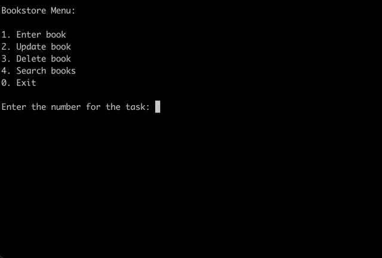

# Library Inventory

This is a database application that manages a collection of books in an ebookstore. The application uses SQLite3 and the tabulate library to interact with the database and display data in a readable format.

### Content

- Initialize the database by creating the books table if it doesn't already exist
- Populate the books table with a list of books data
- Enter a new book into the database
- Update an existing book in the database
- Delete a book from the database
- Search for books in the database by title or author

### Requirements

- Python 3.x
- sqlite3
- tabulate

### Usage

1. Clone the repository to your local machine

```
$ git clone https://github.com/username/ebookstore-database-application.git
```

2. Navigate to the project directory

```
$cd ebookstore-database-application
```

3. Run the script

```
$python ebookstore.py
```

### Contributions

Contributions are welcome. Feel free to submit a pull request or create an issue for any bugs or enhancements.


